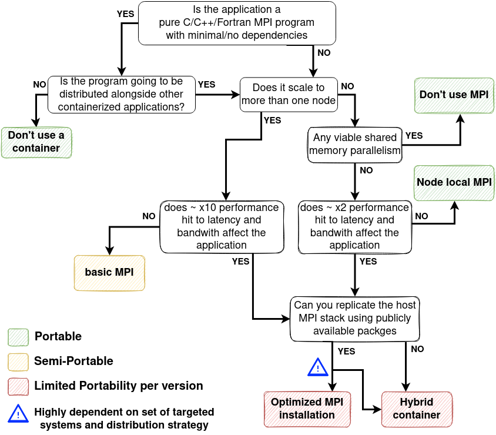

# Introduction to using MPI with containers
**Prerequisites**

 - Familiarity with MPI
 - Basics in compiling software
 - Basic understanding of generic linux environment
 - Basics of software containers

**Target audience**

 - Users wanting to construct MPI containers
 - Developers wanting to distribute their MPI dependent software
 - HPC system maintainers wanting to enable MPI containers

**Goals**

 - Know when to combine containers with MPI
 - Be able to select a feasible strategy (not necessary able to implement) 
 - Comprehend the limitations, difficulty and trade offs when using MPI containers.


## Introduction
The motivation for the endeavor of putting MPI applications inside a container
boils down to why we want to use MPI and why we prefer it inside a container.
The goal is **not** to perform heroic installations for some esoteric MPI configurations, nor is it to come up with a solution to run a MPI container on any kind of system.  With MPI being the de facto standard for distributed highly coupled computations we are most likely already using it directly or as a dependency, making the first question moot. The second question is trickier. 

We will consider two potential benefits provided by containerization:

- **Ease of use:** How easy is it to install and run the software
- **Portability:** Minimizing the amount of work which has to be done to support the software on multiple systems

(_There are other benefits such as  reproducibility, but they are not that strongly linked with MPI so we will not discuss them here._)
As we are in the business of High Performance Computing (HPC) we must of course 
balance the potential benefits against performance losses.

> **IMPORTANT!**
> 
> Both MPI and containers are means to an end. Not goals in themselves. If targets like performance, ease of use and good science can be achieved using other methods, use those! 


In this material we will briefly touch upon why MPI is such a tricky component, explain the main approaches to combine MPI with containers and discuss when it is actually worthwhile to use MPI containers. We do not stop and explain all terms and technologies as this would turn into a whole book. If you encounter unfamiliar terms, you can look them up later or think of them as some black boxes. Most chapters will contain a _takeaway_ box which summaries the key points, without to much technical details. Additionally we provide _bonus_ links to more information about discussed topics, or to loosely related topics. These are never required to follow the material and mainly serve as suggestions for further study for people who really want to understand the whole ecosystem. 

## Container abstraction

For the purpose of this material the following container definition is sufficient

> A container is an application which brings its own set of files, configurations and
> libraries that are neatly packaged into a single file 

On Linux when you type `ls` in the shell, it will execute the file `/usr/bin/ls`
which will load some libraries from under `/usr/lib64` to work. If we have have a container
image e.g `my_container.sif` we would do something like  `container-run my_container.sif ls`.
This would also execute the file `/usr/bin/ls` and use libraries from under  `/usr/lib64` but "inside" the container. The container versions of the files could be completely different
and incompatible with the their non-container equivalents. So the container effectively
starts the program in a different place and then makes that directory look like another directory.  
```
/bin
/lib
/usr
 ├── bin
 	 └── ls 
 └── lib64
 /home
  └── user 
      └── data
 
/CONTAINERS
 └── MYCONTAINER
	 ├── bin
	 ├── data
	 ├── lib
	 └── usr
	     ├── bin
	 	     └── ls 
	     └── lib64

```
Technically not an accurate picture, but in our example our program would start 
in `/CONTAINERS/MYCONTAINER` believing it to be the `/` directory.   
The container does not need to be completely isolated, in the above example we could
use a so called bind mount to link `/CONTAINERS/MYCONTAINER/data` to `/home/user/data`
so that any files written to the first directory appear in the second directory outside the container. Effectively a symbolic link. 

Note that in this simple model the container does not "fake" anything but the filesystem (compare this to a virtual machine which will also has its own Linux kernel and machine architecture) and used the host Linux kernel. This means that as soon as an application inside the container makes a systemcall (i.e talks to the kernel) it is no longer "inside" the container. If your program contain systemcalls which are not supported, the program will fail. Likewise there is no virtualization for the CPU architecture, so a container built on an `x86` machine will not run on an `arm` CPU and vice versa.   


For more information about containers, refer to documentation for common container runtimes:

- [Singularity](https://sylabs.io/guides/latest/user-guide/)
- [Docker](https://docs.docker.com/)


For our examples we will be using singularity. See https://sylabs.io/guides/latest/user-guide/ for more information on the syntax.


## High-level overview of MPI

### Startup

From basic MPI tutorials you will know that a MPI programs can be started with:

```
mpirun -n <tasks> ./my-app
```

Or if using a batch scheduler (in this case Slurm, which will be used from here on now; other batch-job systems "should" behave similarly):
```
srun -n <tasks> ./my-app
```
_Depending on your system setup, the MPI might be linked against the batch system, in which case `mpirun` is using the batch system infrastructure. If you don't have to manually specify the list of nodes to run on, `mpirun` is most likely using the batch scheduler infrastructure._

Without going into to much detail, the launch process for `srun` is as follows:

- Slurm has daemons (essentially a background process spawned at startup) running on the login node and all compute nodes. 
- When we do `srun`, slurm will contact the daemons on each node which are responsible
 for setting the correct environment and launching the actual MPI tasks. Slurm will then pass them the required information, e.g. what binary to launch, how many tasks to launch  etc.  
- The daemons launch the MPI application
- When doing `MPI_INIT` the process will fetch + exchange the information needed to know
	where the other ranks are and how to connect to them.  
	- Resolving and creating connections might also be done dynamically the first time it
		is actually needed.
	- In the case of Slurm, an environment variable is set for the process which tells it
	where to find a server which it can contact to fetch and exchange information 
- The generic term for the program managing the spawning of MPI ranks and setting up the communication between them is a process manager and the interface referred to as a  Process Management Interface (PMI)
	- There are multiple different process managers (e.g Slurm, hydra, orte, PRRTE) and multiple Interfaces (e.g PMI1 , PMI2 and PMIx). The interfaces are relatively interoperable (PMIx tries to maintain compatibility with PMI1 and PMI2) but if there are
	incompatibilities the MPI program will mostly likely crash already in `MPI_Init` (or then you get other strange error which might or might not affect the program). Note that this compatibility is one way so PMIx server + PMI2 client is ok, but the other way around might not work. 
		- Note that this compatibility is one-way. So Slurm using PMIx and the application using PMI2 most likely works but not the other way around. 
- The communication channel to the process manager can be socket or network port based
	- Sockets require bind mounting into the container to be visible. 

If `mpirun` is acting alone the process is mostly the same, the daemons just are not initially running and need to be started (`mpirun` would then most likely try to use `ssh` or `rsh`  to connect to compute nodes ). This is not recommended for larger runs (if it works at all) as the startup times become very long. The exception to this if all task are run within a single node, which is also the same node `mpirun` is running on. 

> `srun` allows us to to set the used PMI with the `--mpi` flag. Other schedulers should have similar options.

#### Takeaway 

> During startup ( `MPI_Init` ) a MPI rank is going to talk to a process manager 
> to find how to communicate with other ranks. If the MPI program is configured to use an incompatible communication scheme, it will fail.      


#### Bonus
For additional information (which goes beyond the scope of this material) you can look at:

- [Slurm MPI guide](https://slurm.schedmd.com/mpi_guide.html) 
- [PMIX](https://pmix.github.io/)
- [MPICH notes on process management](https://wiki.mpich.org/mpich/index.php/Frequently_Asked_Questions)
- [Slurm jobstart](https://slurm.schedmd.com/SC17/Mellanox_Slurm_pmix_UCX_backend_v4.pdf) 


### Communication
**Disclaimer:** 

>The complete MPI stack is very complex. What we present here is a very crude approximation where clarity overrides exact technical correctness.

How the MPI library exactly implements communication between tasks is usually not a concern for the application developer, as long as the right data is at the right place all is good. It does however matter a lot from a performance point of view. 

The standard calling procedure for communication is basically:
```c
NODE 1                         					NODE 2 
                            
User                           					User 
	|----------------|            						|----------------|            
	| Application    |            						| Application    |
	|----------------|            						|----------------|            
	| MPI library    |            						| MPI library    |            
	|----------------|            						|----------------|            
	| More libraries |            						| More libraries |            
	|----------------|            						|----------------|            
____________________________   					__________________________                
Kernel                         					Kernel                 
	|----------------|            						|----------------|            
	| Kernel modules |            						| Kernel modules |            
	|----------------|            						|----------------|            
	| Device drivers |            						| Device drivers |            	
	|----------------|            						|----------------|            
____________________________   					__________________________
Hardware                       					Hardware                  
	|----------------|            						|----------------|            
	| Network device |==================================| Network device |             
	|----------------|       interconnect (cables)		|----------------|              
```
So the applications calls `MPI_Send`/`MPI_Receive` from the MPI library. The library in turn calls some lower level / system libraries. At some point a systemcall is made 
and execution moves to the Linux kernel. In the kernel there are again multiple levels of kernel only libraries (here called kernel modules) being used. These will then eventually call device drivers which communicate directly with the underlying hardware.
The hardware will then do as instructed and send the data. If the communication is between processes on the same node, as opposed to cross-node, no device drivers would be called (unless the filesystem is used for some strange reason) and the transfer would take place in process memory (the kernel is still involved). 

> **IMPORTANT!** 
> A container can only carry stuff **above** the kernel line, everything else comes from the host we are running on.
 
For cross-node communication a basic MPI library would most likely use TCP sockets to transport the data (A minimal [example](https://www.geeksforgeeks.org/tcp-server-client-implementation-in-c/)). So one process waits for a connection, the other process connects and then they can exchange data. For intra-node communication some sort of memory mapping (so processes would share access to some region of memory) would be used. Both of these of course rely on the kernel to work, but are features which can be expected to exist in any sensible Linux kernel. We will refer to a MPI installation using only standard Linux functionality for communication, as a basic or un-optimized MPI installation.  

At some point people thought that the basic approach is too slow and came      
up with some solutions (list not exhaustive):

- Specialized kernel modules
	- xpmem, CMA, knem
- Specialized network hardware
	- Infiniband, OmniPath, Slingshot
- Remote Direct Memory Access (RDMA) hardware
	- Nodes can exchange data in main memory without involving the CPU or operating system of either node. 
- Kernel bypass
	- Partially or completely bypassing the kernel network stack
	- Data transfers can be initiated directly from userspace (setup still involves the kernel) 

The hardware naturally requires its own kernel modules and device drivers to be usable. The specific version, setup and configuration for all these components can vary greatly from supercomputer to supercomputer. 

Some of these improvements we get for "free", i.e if the specialized network interconnect has a much lower latency and higher bandwidth when compared to off the shelf solutions, the MPI program will run faster even if we use the basic TCP sockets. All the other improvements require that the correct userspace libraries are in place, that the correct kernel modules are in place and that the MPI (or some lower level communication library, e.g ucx) is actually aware of all these fancy features. Otherwise the MPI library is going to the default (slower) communication methods or
fail during communication. Failing is common if there is a version mismatch or incompatibility between the userspace software and the kernelspace software.  

> Proper parallel file IO might also require that MPI is built with support for the parallel file system (e.g lustre) and that any userspace and kernelspace libraries are interoperable.  

#### Takeaway
> - Using anything other than default communication in MPI requires specific libraries and kernel modules to be present and correctly configured
> - Only part of these components can live "inside" a container.     

#### Bonus
- [Example MPI stack](https://docs.mellanox.com/download/attachments/12013395/image2019-1-10_10-55-56.png?version=1&modificationDate=1556812992363&api=v2)
- [Another MPI stack](https://wiki.cc.dvo.ru/images/thumb/d/d4/OFED-Software-Stack.jpg/800px-OFED-Software-Stack.jpg) 
- [Few words on RDMA](https://www.rohitzambre.com/blog/2018/2/9/for-the-rdma-novice-libfabric-libibverbs-infiniband-ofed-mofed) 
- [Presentation about OpenMPI internals](https://github.com/easybuilders/easybuild/wiki/EasyBuild-Tech-Talks-I%3A-Open-MPI) 


## MPI inside a container. 

Now that we have some sort of understanding of how MPI programs start and run, 
we can start thinking about how we can use MPI for a program inside a container. 


### Fully containerized, basic
The first and easiest approach is to simply install a completely basic MPI library
inside a container and use that to compile our program during container construction.
The advantage of this is that it is very easy. The disadvantage is that it is slower than a optimized MPI installation, [more on performance implications](#performance). We essentially have two options how we are going to use this container on a HPC system. Either some degree of portability is sacrificed in order to run multi-node MPI jobs, or we restrict execution to within a single node. The loss of portability is caused by the requirement to be compatible with the [startup environment ](#startup) described earlier, as we are required to use the host MPI starter to launch the container. Invoking `srun` or `mpirun` from within the container will not work as new process will not be started inside the container, so neither the MPI program or library will be found (technically there are nasty hacks for this, but they would be extremely fragile and produce the exact same effect as invoking the launch commands from the outside). The exception to this is if `mpirun` is used to launch tasks only on the current node. In this case processes will be spawned as direct children and inherit the container environment. Whether to use the `mpirun` or `srun` is down to site recommendation.
Using `mpirun` will however require that the MPI version for the program is compatible with the outside library. A slightly more stringent requirement when compared to the scheduler compatibility.

### Fully containerized, optimized

If the application performance is highly dependent on the MPI performance, it might be worthwhile to configure an optimized MPI installation inside the container. As we explained [previously](#communication), our userspace components need to be interoperable with the kernelspace components running on the host. One approach to achieve this is just replicating the network stack:
- Check what kind of operating system the target is running
- Check what kind of network stack the target system has
	- Type of interconnect, software distribution type and version
- Check for any additional kernel modules enabled for shared memory transport (e.g CMA,knem,xpmem) 


**During container construction**
- Install all the network stack components 
- Install any other required libraries 
- Build the MPI library against all the installed components
	- It might be required to first build some lower level communication libraries
	- Or there might be a pre-built package available from the same source as the network components.
- Compile program with installed MPI wrappers

Replicating the network stack and MPI installation is by no means an easy task and 
it is easiest to ask for a description from the system admins / software stack maintainers. Also note that some additional tweaks and runtime settings might be needed to work with the external process manager. We have only provided a very simple skeleton as describing the process in detail is beyond the scope of this document.    

 The container is not that portable if we are required to tailor it to each and every 
 target system. Fortunately there is some leniency. Sites most likely simultaneously have a vendor specific and more generic network stack components, so the container can function without vendor specific components. Specific vendor network stack distributions tend to be somewhat compatible between versions, but can as easily break. Note that there is no guarantee that the same version of a network stack software, packaged for different Linux distributions, are compatible. Usually if the installation is misconfigured, the failure mode is fallback to standard communication (e.g TCP) meaning we loose our performance improvement. This can be the contrasted with the failure mode for the process manager which prohibits process launching. Still, depending on the type of incompatibility, complete failure is also an option.    

> **Advanced:**
> 
> By far the most common network component (which consists of both user- and kernel space components) you will encounter is `libibverbs` (along with its siblings `librdmacm` and `libibumad`). `libibverbs` will cover at least Infiniband, iWarp and slingshot.  It is worth noting that there are multiple separate versions of `libibverbs` as vendors sometimes add their own extensions and fixes. Some other low level interconnect interfaces you can run into are: `gni` (for Cray XC), `bgq` (Blue Gene/Q) and `efa` (Amazon EC2 )
> More generic communication abstraction libraries have been developed (libfabric and UCX), but they internally use the interconnect specific API:s, so while they may be helpful for application developers, they will not help in terms of container portability. 
> 
> We can infer part of the network stack on a given machine by examining the:

> - Installed and running kernel modules
> - Host MPI installation configuration, and linked libraries
> - Configuration of other communication libraries and linked libraries
> - Scheduler configuration (for the process management interface)
> - Query system package manager 


#### Takeaway
> - Multi node MPI requires sacrificing some portability
> - Utilizing any high performance network sacrifices even more
>   - The build process can be complicated
>	- Low performance fallback possible.
>	   - User might not even be aware -> possibly bad, we can't fix our mistakes 

#### Bonus 
- [MOFED driver compatibility](https://www.mellanox.com/support/mlnx-ofed-matrix)
- [UCX](https://openucx.org/introduction/)
- [Libfabric](https://ofiwg.github.io/libfabric/)
- [OFED](https://www.openfabrics.org/)
- [libibverbs source doe](https://github.com/linux-rdma/rdma-core)
- [Libfabric source code](https://github.com/ofiwg/libfabric)
- [Stack interface map](https://downloads.openfabrics.org/ofv/OFV-slides-mar10-verbs_extensions.pdf#page=6)
- [Cray MPI](https://www.olcf.ornl.gov/wp-content/uploads/2021/04/HPE-Cray-MPI-Update-nfr-presented.pdf)
- [GPU enabled libibverbs](https://github.com/gpudirect/libibverbs)


### Hybrid MPI container
In some cases we still want to have a optimized MPI container, but the fully containerized approach is not suitable. It might not be possible / too difficult
to find and configure all the software components inside the container, perhaps due to required proprietary vendor specific software libraries. In this case an alternative approach would be the so called hybrid container, where we bind mount the host installed MPI installation into the container and run the program against that.
This means that we only need to care about being compatible with the MPI installation itself and not the whole network stack. The procedure is approximately as follows:

- Install MPI inside the container
- Build the program using the installed MPI
- Bind mount the host MPI (and all needed dynamic dependencies)
- Start the program
	- using either `srun` or `mpirun` outside the container depending on site recommendation.   
Using this approach we will also be compatible with the [startup](#startup) environment (assuming that we mounted any sockets if needed.)

At glance this approach might seem more portable than the fully containerized 
strategy, but this is not generally true. The container is no longer "download and run". The program in the container needs to be compatible with the MPI installation (see the [next](#Cross-compatibility) section) and configuration is now required on the host to find all the needed dependencies. The search for the dependencies can be partially/fully automated (tools in development) but is not fool proof as there exist multiple pitfalls. The search is also too expensive to be performed at runtime, so it would be performed once during configuration (reconfiguration is of course an option).

The failure mode for the hybrid models depends on what dynamic components are found and work. If there are issues with the main MPI library or mandatory components, total failure will occur. While issues with specific high speed interconnect components can just cause the MPI library to fallback to standard communication.    

#### Takeaway
> The Hybrid model trades the dependency on kernel space components and startup environment for a dependency on the host system userspace software stack.  
> Finding all dynamic dependencies is not trivial

### Cross-compatibility

This is a very short overview of what can go wrong when we try to use a MPI
program with a different MPI installation than it was originally compiled against.
In our case the program would be compiled against an MPI library during container construction, but then run against a host native MPI installation on some HPC machine.  
For the rest of this chapter assume that we have found the correct host libraries and bind mounted them into the container (this is not that easy, but we will not cover it in this material). 

> Note that MPICH based implementations are not compatible with OpenMPI based ones. 
> There are some solutions like [WI4MPI](https://github.com/cea-hpc/wi4mpi) which attempt to bridge this gap, but we do not discuss them here.

The errors here can generally not be fixed after building and we present them so that observed errors can be identified and the build procedure for the MPI program can be fixed. Errors include using incompatible compilers, incompatible MPI versions or building using incompatible Linux distributions.

**Shared library version**

If we take a look at our MPI application using `ldd` we can see that it might depend
on `libmpi.so.40` (or similar, e.g. some MPI implementations name them differently). 
Now if we try to run our application against another MPI installation which provides a different version `libmpi.so.42`, we will get the error:

```
error while loading shared libraries: libmpi.so.40: cannot open shared object file: No such file or directory
```
The version bump here would indicate that the library has changed so much that it 
is no longer compatible. So while we could be crafty and edit the dependency name in our program to `libmpi.so.42` (e.g using `patchelf` ), it would most likely not work.  

(See the OpenMPI [README](https://github.com/open-mpi/ompi/blob/master/README.md#backwards-compatibility) and [Website](https://www.open-mpi.org/software/ompi/major-changes.php) for information on OpenMPI version compatibility)


> **Important:**
> - The version number for the `.so` does not inherently match the version of the MPI library (for example, OpenMPI 3.1.4 provides the same `.so` version as OpenMPI 4.0.5.)
> - The library version and program version do not match the MPI **Standard** version
> - Well maintained projects like OpenMPI and MPICH can be trusted to adhere to good `.so` versioning (same major version -> compatible), but generally the same `.so` version for a library does not guarantee compatibility.    

> **Technical note**:
>
> The `.so` version dependency added to a compiled binary is determined by the **SONAME** data field
> in the library being linked. We can view this using the `readelf -d` command on the `.so` file. This data field can be set when compiling the dynamic library. For `gcc` you would add `-Wl,-soname,libA.so.<ver>` to the compilation. This is the reason for the common set of symbolic links found for dynamic libraries:
>```
> libmpi.so -> libmpi.so.40.20.1
> libmpi.so.40 -> libmpi.so.40.20.1
> libmpi.so.40.20.1
> ```
> `libmpi.so` exists to that we can simply use `-lmpi` on the command line when compiling instead of needing to specify the version. `libmpi.so.40.20.1` is the actually fully versioned dynamic library with `SONAME` set to `libmpi.so.40`. As any linked binaries will now be searching for the `libmpi.so.40` file we need the final symlink. This means that the minor version of the library can be changed without re-linking any applications but we fail instantly if the major version is updated (which is preferable to failing in strange ways when using incompatible versions)
>
> "Not found" does not always mean that the library could not be located. At least the glibc version of the dynamic linker will also report dynamic libraries with to high kernel version requirements as "not found" see  [ABI note tag](https://refspecs.linuxfoundation.org/LSB_1.2.0/gLSB/noteabitag.html)


**Extra libraries**

If we have compiled our MPI application using default settings, it is possible that we have linked it against `libmpi_cxx.so` (which provides the C++ MPI API) in addition to `libmpi.so`. If we are actually using the C++ API then it is fine, but if we are not it becomes an issue. If the target MPI installation does not contain the library (C++ support is an optional feature) we will again run into the error from the previous section. One option is to again edit the compiled MPI program and completely remove the dependency, again using `patchelf`. A cleaner solution is to include the `--as-needed` (or equivalent) flag when linking so that only dynamic libraries which are actually used are set as dependencies.   


**Symbol mismatch**
When  building your program and linking it to an external library, you might have encountered errors similar to:
```
undefined reference to foo
```
Where `foo` would be some function or variable which is being used in the program. This error can also be encountered during runtime. In this case the error would be something like: 
```
undefined symbol: foo
```
Without going into to much detail about dynamic symbols:
- You have a function call `foo` somewhere in your program
- When the program is compiled a dependency for `foo` will be created  
- Some dynamic library `libA.so` contains a definition for `foo`  
- When the program starts, it is going to see that it needs the `foo` symbol, and try to find it in any linked dynamic libraries
- If found, the program will know what to run when it calls `foo`. If not found, the program will stop with the above message.  

 During a normal execution, the symbol is most likely searched lazily, so the program will only fail due to a missing symbol when actually trying to use it instead of at the very beginning. Checking for compatibility this way not desired as the program might run for a long time before stopping. This can be avoided by setting `LD_BIND_NOW=1` or inspecting the program using `ldd -r libA.so`   

> **Symbols**
> 
>Only the name of the symbol is used to find a match. So any of the following definitions
>in `libA.so` would fulfill the `foo` dependency in our program.   
> ```c
> int foo=2;;
> char foo[4]={'A','B','C','D'};
> int foo(int a,int b){
> 	return a*b;
> }
> char foo(){
> 	return 'A';
> }
> ```
>While it's unlikely that some one has changed a function to an array, a more probable case would be that that the library has changed, added or removed some function arguments.  
>
>- The name of the symbol does not necessarily match the name used in the source code and also varies between different compiler versions and implementations. This is called name mangling
>- For example `g++` adds additional information to the symbol name such as function arguments to the symbol names  
>
> This function definition
> ```c++
> int foo(std::string){
> ...
> }
> ```
> compiled with g++ 4.8.5 would produce the symbol name `foo(std::string)`, while gcc `9.1.0` would produce `foo(std::__cxx11::basic_string<char, std::char_traits<char>, std::allocator<char> >)`, again the reason for this is to fail fast when there is a mismatch in the symbol name. (that `__cxx11` in the name is in fact not a reference to the C++ standard used, but to the compiler ABI,more on this later, version. )
> 
> There are several tools for inspecting symbol names. These include `readelf`, `nm` and `objdump`. 

Compiling the MPI Program on CentOS 7 and then trying to run it with a MPI library built with Ubuntu will not work, neither will compiling the program on CentOS 7 and running it against a MPI library built using CentOS 8. You will mostly likely just see a error similar to:
```
... libc.so.6: version `GLIBC_2.14' not found 
```
_for details, look up so called [symbol versioning](https://gcc.gnu.org/wiki/SymbolVersioning)._

This is due to the fact that virtually all dynamically compiled programs and libraries
rely on low level libraries which might not be compatible between Linux distributions. 
The main example is the [GNU C library](https://www.gnu.org/software/libc/) which implements basic `C` functions such as `malloc`, `open` and `exit`. In the case of glibc, it is backward-compatible but not forward-compatible. In other words, you can run programs compiled against an older version of `glibc` on Linux distributions with a newer glibc, but not newer programs with an old glibc. Ironically this is one of the reasons why containers were developed in the first place, to not have this kind of glibc dependency.   


**ABI compatibility**
So far we have implicitly assumed that both the program and library have been compiled using the same compiler, but what if this is not the case? Compilers might internally
use different alignments for data structures, different calling conventions and different sizes for data types. This kind of interface is called an application binary interface (ABI). If you can successfully run a program compiled with one compiler against a library compiled with another compiler, the compilers are said to be ABI compatible. Unless there is a stated compatibility, running a program against a library built with a different compiler will most likely fail. Different compilers here include different versions of the same base compiler (e.g gcc 4.9.3 and gcc 11.0.3). Some general rules:
- C is mostly safe to mix between different compilers
- Fortran compilers are not ABI compatible
- C++ varies, some ABI incompatibilities expected 
	- dependency on `libstdc++.so` with similar limitations as `libc.so`
	- Intel and clang compilers should be ABI compatible versions with gcc, check documentation 
- Using experimental, undefined or no-standard behavior is most likely not ABI compatible

Even if all the `.so` versions, symbols, compilers and system libraries match, the program might still fail due to some internal changes. Just switching the order within a structure is enough. Of course the library maintainer should then have incremented the major version of the `.so`, however it can be dangerous to assume.   

#### Takeaway
> In order to use another library that the one we were initially linked against:
>
> - All dependent `.so` files need to be present
> - The `.so` versions needs to match
> - There should be no missing symbols
> - Compilers need to be ABI compatible
>   - Different requirements for C, C++ and Fortran
> - The compiler relies on system libraries which might not be compatible between Linux distributions
>    - Prefer building older versions as most libraries are backward-compatible
> - Stated compatibility might not be sufficient, always test.
>   - If there is no stated compatibility there is likely no compatibility
> 

#### Bonus
- [MPICH ABI compatibility](https://wiki.mpich.org/mpich/index.php/ABI_Compatibility_Initiative)  compatibility  
- [Writing shared libraries](https://akkadia.org/drepper/dsohowto.pdf) 
- [Glibc](https://www.gnu.org/software/libc/) 
- [Glibc backward-compatibility](https://developers.redhat.com/blog/2019/08/01/how-the-gnu-c-library-handles-backward-compatibility#)
- [Linking different C++ standards](https://stackoverflow.com/questions/46746878/is-it-safe-to-link-c17-c14-and-c11-objects) 

### Performance 

> If you have a pure C/Fortran MPI application **do not** start putting that inside a container. Instead spend the time just making sure the build scripts are well made and portable.    
 
_If your pure C/Fortran program is hard to install, it is either hyper-optimized (in which case the containers won't help you, or it is poorly written. One exception to this advice if is the program is part of larger collection of software which is distributed using containers, then it might be sensible to also place basic MPI applications inside a container._

As with any performance related matters, the general advice is to always test and never assume. It might be that a application only infrequently uses MPI or spends such a long time doing something else, that raw communication performance losses are not that relevant. As a general rule of thumb: The MPI performance impact grows the larger and more tightly couple a given problem is. 

Some very rough estimates for the performance difference between a basic and optimized
MPI installation would be:

- x10 cross node performance loss in bandwith and latency
- x2 intra node performance loss in bandwith and latency

So for the optimized installation a `MPI_Send/MPI_Receive` would take ~ 1 us while for the non-optimized it would be closer to ~ 10 us. Before deciding on the optimal
containerization strategy, the application should be benchmarked to find out:

- How many MPI task does it scale to 
	- cross-node and intra-node might produce different results
	- If shared memory parallelization is available, how does it compare?
- How does the memory consumption scale with the number of tasks
- What is the real walltime impact of using a non-optimized MPI installation?
	- Install a stock MPI to run against / disable high speed network (using environment variables or similar.) 

If the application scales poorly there is little point in risking the [startup](#startup) incompatibility (unless system resources are extremely fragmented ). Likewise the added complexity of the optimized MPI approaches, might not be worth a 1% increase in performance.   

#### Takeaway
 > Using a non-optimized MPI installation might or might not affect the performance of your application. Always test! Don't add complexity or sacrifice portability for optimizations which have no real effect.

#### Bonus
- [Intels MPI benchmarks](https://github.com/intel/mpi-benchmarks)
- [OSU benchmarks](https://mvapich.cse.ohio-state.edu/benchmarks/)

## Conclusion

As we have seen, it is completely possible to use MPI in conjunction with containers and we have multiple different approaches to choose from. The hard part is balancing the loss of portability with performance. The complexity of the whole MPI stack and network ecosystem leads to a type of **unpredictable incompatibility**. So before actually running the container on some system we have a hard time making anything but an educated guess if the container will run or not, and if it were to fail, how it will fail. This is even harder for end-users who are not familiar with MPI (and most likely would not read through a document like this) and just want to use the container as a black box. Furthermore, the complexity can make it difficult for end-users to identify issues in a way which would allow us to address them.

The flowchart summarizes the available options. 

**Flowchart for strategy selection**  

We are able maintain full portability using one of the following approaches:

- Discarding the container (assuming minimal other dependencies)
- Not using MPI (MPI is not a goal!)
- Restricting execution to within a node [(details)](#fully\ containerized,\ basic). 

Using a basic MPI installation inside the container enables multi-node execution [(details)](#fully\ containerized,\ basic), but introduces the risk of being incompatible with the [startup](#startup) environment. For improved performance we can install an [optimized MPI installation](#fully\ containerized,\ optimized), but this will reduce the number of systems that the container can run on [(details)](#communication). The final approach is the [hybrid approach](#hybrid\ mpi\ container) where we utilize the host MPI library. This requires configuration on each system before running the container and also reduces the number of systems that the container can run on (but not in the same way as the previous approach, [(details)](#cross-compatibility) )

The most suitable strategy will be largely depend on the type of application, set of targeted systems and 
available effort to package and maintain the different solutions. We hope that this material will help the reader in deciding what strategy to pursue. 
